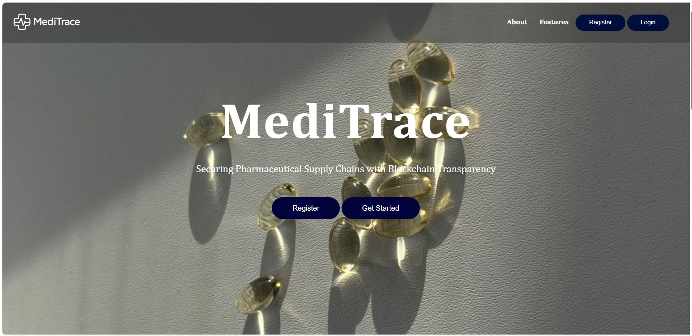
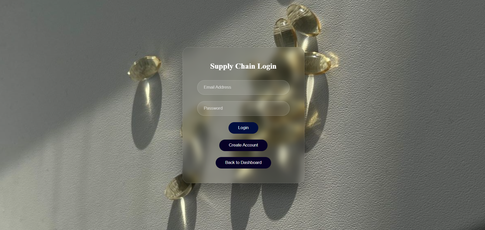

# MediTrace – Pharmaceutical Supply Chain Tracking and Verification System

## Project Overview

MediTrace is a blockchain-based pharmaceutical supply chain tracking and verification system developed using Node.js, MongoDB, Ethereum Blockchain, Solidity, and Hardhat.

The system is designed to improve medicine traceability, prevent counterfeit drugs, and provide secure and transparent tracking of pharmaceutical products across manufacturers, distributors, pharmacies, and customers.

## Features

- User Registration and Authentication
- Role-Based Access Control
- Admin Approval System
- Manufacturer Medicine Registration
- Medicine ID Generation
- QR Code Generation and Verification
- Blockchain-Based Medicine Tracking
- Supply Chain Ownership/Transaction Tracking
- Distributor and Pharmacy Management
- Medicine Authenticity Verification
- Secure Smart Contract Integration
- MongoDB Database Integration
- Responsive Web Interface

## Technologies Used

### Frontend

- HTML
- CSS
- JavaScript

### Backend

- Node.js
- Express.js

### Database

- MongoDB
- Mongoose

### Blockchain

- Ethereum
- Solidity
- Hardhat

### Authentication

- JWT (JSON Web Token)

### APIs and Tools

- REST API
- Postman
- GitHub
- VS Code

### Other Technologies

- QR Code
- Smart Contracts
- Web3 / Blockchain Integration

## System Architecture

The MediTrace system follows a layered architecture consisting of:

- User Layer
- Frontend Layer
- Backend Layer
- Database Layer
- Blockchain Layer
- QR Code and Medicine ID Generation

The frontend communicates with the Node.js and Express backend through REST APIs. MongoDB stores application data, while Solidity smart contracts maintain immutable pharmaceutical transaction and verification records on the Ethereum blockchain.

## Working of the System

1. Users register on the MediTrace platform.
2. The administrator verifies and approves registered users.
3. Manufacturers register medicines with relevant product details.
4. The system generates a unique Medicine ID and QR code.
5. Medicine information and transactions are recorded securely.
6. Manufacturers transfer medicines to distributors.
7. Distributors transfer medicines to pharmacies.
8. Each supply chain transaction is recorded for traceability.
9. Customers scan the QR code or enter the Medicine ID.
10. The system retrieves the medicine information and verifies it using blockchain records.
11. The verification result is displayed to the customer.

## Blockchain Integration

MediTrace uses Ethereum blockchain and Solidity smart contracts to maintain secure and tamper-resistant pharmaceutical transaction records.

Blockchain technology is used to:

- Maintain immutable transaction records
- Track medicine movement
- Verify medicine information
- Prevent unauthorized modification
- Improve supply chain transparency
- Maintain traceability throughout the product lifecycle

## Why These Technologies Were Used

- **Node.js** was used to develop the backend because it supports efficient and scalable server-side applications.
- **Express.js** was used to build REST APIs and handle backend requests.
- **MongoDB** was selected for flexible and scalable document-based data storage.
- **Mongoose** was used for database schema modeling and MongoDB operations.
- **Ethereum Blockchain** was used to maintain secure and tamper-resistant transaction records.
- **Solidity** was used to develop smart contracts for blockchain operations.
- **Hardhat** was used for smart contract development, testing, and deployment.
- **JWT** was used for secure user authentication.
- **QR Codes** provide a simple method for customers to verify medicines.

## Applications

MediTrace can be used in:

- Pharmaceutical manufacturing
- Medicine distribution
- Pharmacies
- Hospitals
- Healthcare supply chains
- Medicine authenticity verification
- Pharmaceutical regulatory monitoring

## Future Scope

- Mobile application for medicine verification
- IoT-based real-time medicine tracking
- GPS-based transportation monitoring
- AI-based counterfeit medicine detection
- Integration with public blockchain networks
- Cloud deployment for large-scale usage
- Advanced supply chain analytics
- Integration with healthcare and pharmaceutical regulatory systems

# Screenshots

## Home Page

## Login Page

## Admin Dashboard

## Manufacturer Dashboard

## Distributor Dashboard

## Pharmacy Dashboard

## Medicine Registration

## QR Code Verification

## Medicine Verification Result

## Supply Chain Tracking

## System Architecture

## Workflow

## Developed By

**Misriya A A**  
MCA Student  
Ilahia College of Engineering and Technology

**Project:** MediTrace – Blockchain-Based Pharmaceutical Supply Chain Tracking and Verification System
